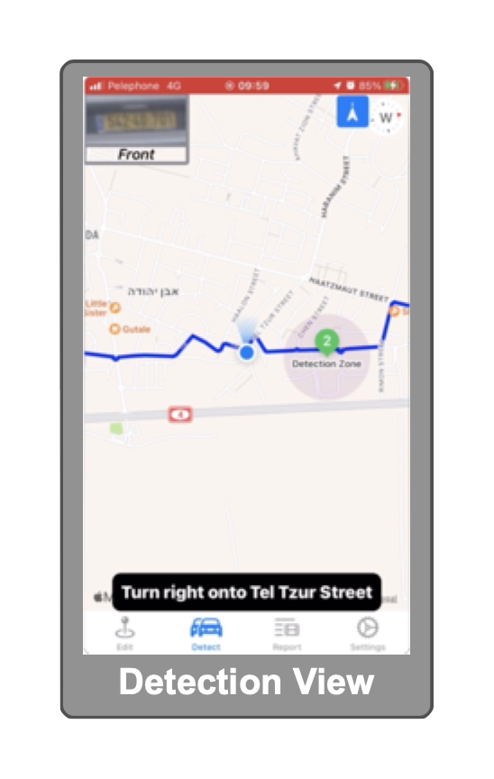

# TailDetector

The **TailDetector** is an automotive system for surveillance detecting. 
It was developed as a Proof of the Concept of using a computer vision system to detect possible car surveillance. 

The system consists of three major components:
* Four [Cameras](#cameras) installed inside a vehicle (one front camera and three other on the back of the vehicle).
* A [Single Board Computer](#single-board-computer) with high GPU capabilities enabling complex AI operations for automated license plate recognition.
* An [Ios Application](#ios-application) to draw "detection routes", control the single-board computer and to get alerts in case of detected surveillance ("Tails").

## Cameras
I am using Basler dart cameras with USB 3.0 interface. [According to Basler](https://www.baslerweb.com/en/vision-campus/interfaces-and-standards/usb3-interface-future/), USB 3.0 Vision interface offers a 350 MB/s bandwidth volume, which is suitable for this scenario. This interface also offers highly reliable data transfer between host and device and integrated (buffer) memory for top stability in industrial applications. Wiring inside a vehicle does not require more than 8m cable length (also supported by this interface). 

## Single Board Computer
Nvidia produces very popular developer kits suitable for missions like this. I am using Jetson Xavier NX Developer Kit. Xavier NX has very impressive GPU features: 384 CUDA cores + 48 Tensor cores Volta GPU, 21 TOPS. There are 4 USB 3.0 ports on board. For more details See [Jetson Xavier NX Developer Kit](https://developer.nvidia.com/embedded/jetson-xavier-nx-devkit).

This single-board computer is actually the core of the system. Within this component the following functionality is managed:
* Transferring the streamed video into a "number plate recognition" service via Gstreamer pipelines.
* Automation of number plate recognition functionality using [Rekor Scout OpenALPR agent](https://www.openalpr.com/software/scout) (daemon). 
* Mediation layer (python process) for orchestration and mediation between all subsystems on the sbc: cameras functionality, daemons, two-way communication with ios application via [peertalk protocol implementaion](#peertalk-protocol-implementation) etc.
* Multiplexing connections over USB to the iOS device using [USBMUXD](https://github.com/libimobiledevice/usbmuxd) daemon. 

## Ios Application
The ios application has capabilities such as: drawing a detection route, starting a surveillance detection phase and finally getting corresponding alerts.
Here, too, the two-way communication iOS-Linux is done by USBMUXD. Although wireless interfaces (e.g WiFi) for maintaining this communication could be much simpler and intuitive, I chose to implement the entire iPhone-Jetson communication using peertalk over USB connection (i.e "closed system"). This choice can be considered as one more step toward reducing possible attack surface. In this decision exist at least one downside: the ios device must be connected to the jetson during all the detection phase.

# General scheme of the system

  

## Peertalk Protocol Implementation
Seeking for secured wired communication between the iOS application and the core of the system (the Jetson Xavier), I encountered a pretty simple solution: USBMUXD and peertalk.

For the core system (Jetson) I extended the usbmux python script of [Hector Martin "marcan"](https://code.google.com/archive/p/iphone-dataprotection/source/default/source) to support three different channels of communication between two devices (iOS device and Linux device):
* Command - The iOS Application sends control messages directed to the Mediation subsystem on the Jetson device. The Mediation subsystem sends an appropriate response.
* Video - The iOS Application receives a stream of video frames from a selected single camera using the Mediation subsystem as a mediator. This feature enables camera preview prior the detection phase. 
* Vehicle - All vehicle recognition data produced by the OpenALPR agent encapsulated using the Mediation subsystem and being sent to the iOS application for further processing. 

[David House](https://github.com/davidahouse/peertalk-python) script example was very helpful in demonstrating how to create a communication channel using marcan's usbmux implementation. 
Finally, in order to implement these three channels in swift (on iOS device) I am using [Rasmus](https://github.com/rsms/peertalk) implementation of Cocoa library for communicating over USB. I also extended his PTChannelDelegate to support the three peertalk channels mentioned. 

# Installation Guide (Jetson Xavier NX)

## Pylon Camera Software Suite
Working with [Basler cameras](https://www.baslerweb.com/en/embedded-vision/embedded-vision-portfolio/embedded-vision-cameras/) require using pylon software. In this project I created two utilities using pylon c++ API. Pylon also support python (pypylon), but I have found it more convenient to use their c++ API. 
These two utilities are responsible for frame grabbing: [RegularGrab](Pylon/SingleCamera/RegularGrab.cpp) grabs frames from a given camera (using camera serial number as an argument), manipulate the grabbed frames and finally writes frames into v4l2 loop device (/dev/video device); 
[Grab_MultipleCameras](Pylon/MultipleCameras/Grab_MultipleCameras.cpp) get a list of pairs (camera's serial number, video loop device). It grabs frames from all cameras and writes frames to the corresponding video loop device.  
Software suite for Linux x86 (64 Bit) can be found here: [pylon 6.3.0 Camera Software Suite](https://www.baslerweb.com/en/sales-support/downloads/software-downloads/software-pylon-6-3-0-linux-x86-64bit/). Pylon's default installation folder is `/opt/pylon`. Along C/C++ code samples, Pylon provides very useful utility for cameras viewing, capturing and configuring: `/etc/pylon/bin/pylonviewer`.  

## V4l2loopback
In order to stream all grabbed frames from cameras to the OpenALPR daemon (via GStreamer pipeline as the daemon's requirement), we need to use v4l2 loopback devices.
Installation instruction can be found here [v4l2loopback](https://github.com/umlaeute/v4l2loopback).
In case of four cameras I am submitting this simple line after installation is finished.

    # modprobe v4l2loopback devices=4

Check that four devices have been created
~~~    
crw-rw----+ 1 root video 81, 0 Feb 17 11:50 /dev/video0
crw-rw----+ 1 root video 81, 1 Feb 17 11:50 /dev/video1
crw-rw----+ 1 root video 81, 2 Feb 17 11:50 /dev/video2
crw-rw----+ 1 root video 81, 3 Feb 17 11:50 /dev/video3
~~~~

## USBMUXD
See [libimobiledevice](https://libimobiledevice.org/), a cross-platform library to communicate with iOS devices natively.
Plug your iOS device and perform a simple check to ensure installation:
~~~
# ideviceinfo -k ProductVersion
15.3.1
~~~~

## Startup services
Naturally TailDetector is designed to operate as a headless system. In order to support this the system (the Jetson) must initiate itself and communicate with attached iOS devices. 
There exist two services for this task:

### [usb_listener.service](Startup/usb_listener.service)
This service is responsible for restarting the Mediation subsystem every time the Jetson is turning on.

~~~
# usb_listener.service
[Unit]
Description=Start usb_listener.py

...

[Service]
Type=simple
ExecStart=/usr/bin/python3 ~/TailDetector/Mediation/usb_listener.py
StandardInput=tty-force
Restart=on-failure

...
~~~~

The file should be copied to `/lib/systemd/system`. After copying, run the following lines:

    # systemctl status usb_listener.service
    # systemctl enable usb_listener.service
    # systemctl start usb_listener.service

### [video_capture.service](Startup/video_capture.service)
This service is responsible for two operations:
* Creating four v4l2 loop devices at startup and once.
* Redefining how much USB-FS memory is needed. For Basler's cameras the process of acquiring an image is divided into three steps: 
Image acquisition by the camera's hardware; Data transfer in which the computer receives the collected information; Image grabbing by the pylon application. USB-FS memory is where each image transferred from the camera to the computer is stored. 
The kernel memory which is allocated for the use with USB on a typical 64-bit Ubuntu system is 16MB. This memory size should be redetermined as follows:
number of buffers (the maximum frame rate of the camera) * camera Resolution * bit-depth * number of cameras. For example: 4 dart cameras (1280 X 720), RGB with 8 bit pixel format, 54 fps.
usbfs_memory_mb = 4 * (1280*720) * 3 * 8 * 54 =~ 600MB. In case of memory shortage 22 fps are sufficient, hence usbfs_memory_mb can be defined to 256MB.  

~~~
# video_capture.service
[Unit]
Description=Create /dev/video* entries and define usbfs_memory

...

[Service]
Type=simple
ExecStartPre=/sbin/modprobe videodev
ExecStart=/sbin/insmod ~/v4l2loopback/v4l2loopback.ko devices=4
ExecStartPost=/bin/sh -c 'echo 256 > /sys/module/usbcore/parameters/usbfs_memory_mb'

...
~~~~

## OpenALPR Rekor Scout agent
Rekor Scout is a commercial Vehicle Recognition Platform. It suited my Proof Of Concept objectives. Installation instructions can be found here: [Install Scout Agent](https://docs.rekor.ai/getting-started/rekor-scout-quick-start/install-scout-agent). I tested the agent on Ubuntu 18.04, Ubuntu 20.04 and on Nvidia Jetson Xavier NX and nano. Jetson Family is a good choice as a host due to NVIDIA GPU hardware. The Scout Agent performance can be accelerated by the GPU hardware. For this purpose Rekor maintains special binaries to work directly with NVIDIA GPU's.
### Configurations

Rekor Scout agent uses miscellaneous configuration files. 

#### alprd.conf
The primary configuration file for the Scout Agent is located in `/etc/openalpr/alprd.conf` file.
On the Jetson Xavier NX I added these changes to override defaults:
~~~
# Each thread consumes an entire CPU core. Jetson Xavier has 6 cores.
analysis_threads = 6

# Wanted to start the agent via the iOS application and not automatically on the Jetson's Boot.
auto_start_on_boot = 0

# Scout automatically classifies vehicle make/model, color, and body type for each license plate group it detects.
classify_vehicles = 1 

# Every country uses a different format and size of number plate.
country = il

# Improves efficiency. The ALPR processing only analyzes frames with movement, ignoring areas of the image that have not changed.
motion_detection = 1 

motion_stickiness = 10
parked_car_max_delta_ms = 1000

# Groups similar plate numbers together in one JSON unit. 
plate_groups_min_plates_to_group = 1
plate_groups_time_delta_ms = 1000

# Disable storing data on host
store_plates = 0
store_plates_maxsize_mb = 0
store_video = 0
store_video_maxsize_gb = 0

# Disable data uploading 
upload_data = 0
store_plates_maxsize_gb = 0
~~~~

#### my_new_camera.conf

The agent must be configured to connect to one or more camera streams to process license plates. Each camera require its configuration file in the folder `/etc/openalpr/stream.d/`.   
For example, if we are using two cameras, two configuration files are needed:
~~~
# /etc/openalpr/stream.d/dart1.conf
stream = dart0
camera_id = 0
gstreamer_format = v4l2src device=/dev/video0 ! video/x-raw,format=RGB ! videoconvert ! 
  videorate ! video/x-raw,framerate=30/1,width=1280,height=720 ! appsink name=sink max-buffers=10
~~~~

~~~
# /etc/openalpr/stream.d/dart2.conf
stream = dart1
camera_id = 1
gstreamer_format = v4l2src device=/dev/video1 ! video/x-raw,format=RGB ! videoconvert ! 
  videorate ! video/x-raw,framerate=30/1,width=1280,height=720 ! appsink name=sink max-buffers=10
~~~~

Each video source (e.g. camera, video file) needs to be configured. 
In this POC the GStreamer pipeline is arranged to handle pulling video from a specific /dev/video device, to which image frames 
from [RegularGrab](Pylon/SingleCamera/RegularGrab.cpp) and from [Grab_MultipleCameras](Pylon/MultipleCameras/Grab_MultipleCameras.cpp) are written.
Each License plate that was recognized and processed by Rekor Scout is displayed in the iOS application in a small frame in the upper left corner. 
This feature is useful in two aspects: It gives us indications that all cameras involved in video capturing. It also serves as the system sign of life indicator.
Using ***camera_id*** key-value in each camera configuration let us maintain a b-directional reference mechanism between the iOS application and the Jetson. 
This mechanism helps us to identify which camera captured the processed license plate.

#### Integration with Rekor Scout agent

I prefer to integrate with the Rekor Scout agent "on-premises" and offline. 
Rekor Scout supports this configuration by storing data locally in beanstalkd queue.
The Mediation subsystem inside Jetson grabs and processes the latest plate results from this queue.
Choosing to work with a queue by adding `use_beanstalkd = 1` to `alprd.conf` or by using the alprdconfig gui: 

  

 

# iOS Application - TD

iOS Application have four main views:
* **Edit View** - In this view the user can draw a detection route by using long-press gestures to define detection points. Through these detection-points the system will draw a route (Detection Route). 
Around each detection point a circle with a pre-configured radius will be drawn. The circle is meant to define the zone where the system will process all recognized license plates and vehicles using some algorythm to determine if a surveillance was detected.
A single-tap gesture on a defined detection point will pop a small menu with Replace/Remove options.
* **Detect View** - After defining at least three detection points, the user can begin the detection process by pressing the "Start" button.
All vehicles' data that was processed at the start point (inside a pre-configured radius) will be saved fo later processing. 
During all the detection phase the Jetson will process all captured vehicles. Only when inside the perimeter of a detection point (i.e. the violet circle) the recognized vehicles will be treated by the detection algorythm.
And only inside these circle the user will notice violet frame around the license plate preview in the upper left corner of the screen.
Outside these detection points, the frame will have a grey color, meaning the algorythm is ignoring the recognized vehicles. 
The algorithm (actually very naive one) is located in the app, of course. 
If the application sees that at least in two different detection points the system caught the same vehicle, it means that there is a high likelihood of surveillance.  
Even if the Rekor Scout agent could pick a partial license plate number, the algorythm is designed to decide if this partial algorythm is a substring of already recognized license plate.
When an event of Detection occurred, the application will pop a floating view with the vehicle image and the other necessary meta-data.
The user will be able to view a report to decide if the application truly detect a surveillance. 
The user is provided with another view (a map) with all the points where the system encountered this vehicle. 
In order to get an accurate results, the user must define an appropriate route for detection.
* **Report View** - In this view the user can view two lists of vehicles: Those with high probability of surveillance, and those with a lower probability.
Usually those with low probability will be vehicles with partial license plate number that matches a substring of another vehicle's license number.
* **Settings View** - This view contains a section to control the headless Jetson and a section to control some features of the application itself.
    * **Jetson Disconnected** - This toggle button is readonly from the user point of view. When the user plug the iOS device (USB cable) to the Jetson, a peertalk connection is established. The toggle button is turned on.
    * **Cameras View** - In this view the user can select an already defined camera, send a command to the Jetson (Mediation subsystem will invoke [RegularGrab](Pylon/SingleCamera/RegularGrab.cpp) process), and receive a stream of video from the selected camera. 
  Camera View is disabled while ALPRDaemon is Up, and vice versa.
    * **Define Cameras** - In order to activate a connected camera the user must define (only once) a camera (i.e. add serial number, define camera name).
    * **ALPRDaemon is Down** - This toggle button is readonly from the user point of view. When on, ut indicates that the application is receiving signals from the Jetson, saying that the daemon is up.
    * **Start All Daemons** - Turning on the toggle button sends a command to the Jetson, instructing the Mediation subsystem to start the Rekor Scout daemon. 
  The Mediation also invokes the [Grab_MultipleCameras]((Pylon/MultipleCameras/Grab_MultipleCameras.cpp)) process to operate grabbing frames from all cameras and to write the grabbed frames to the corresponding video loop devices.
    * **Detect Radius** - Detection radius of a detection point (i.e. the violet circle on map) can be configured.
  Remember that only inside this region the vehicle recognition data is processed by the detection algorythm.
    * **In point Radius** - This value helps the algorythm to mark that your vehicle reached the current detection point.
    * **Recency Filter** - In some cases the application receives multiple packets of data of the same vehicle within a very short interval. This is useless. Recency-filter, when turned on, filters packets of data of the same vehicle if the time interval between the two packets is less than 5 secs or if the distance between the two locations, where captured, is less than 50 meters.
    * **Reset All Data** - Clear all saved detection routes, reports and other stuff. 

  

